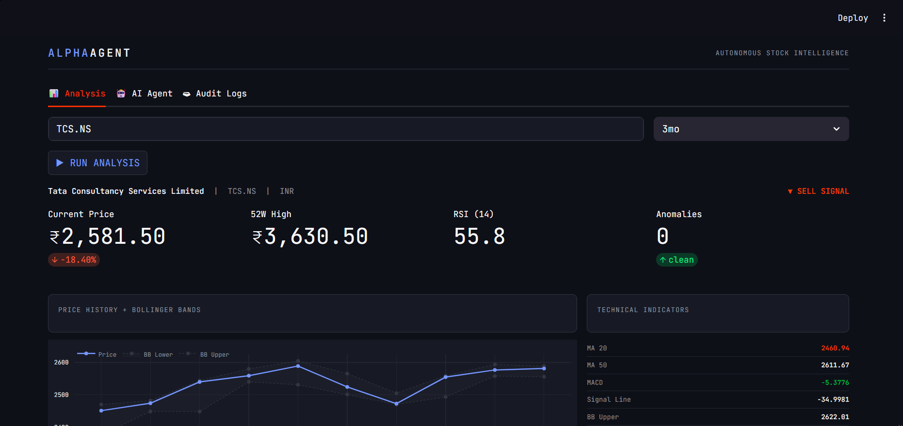
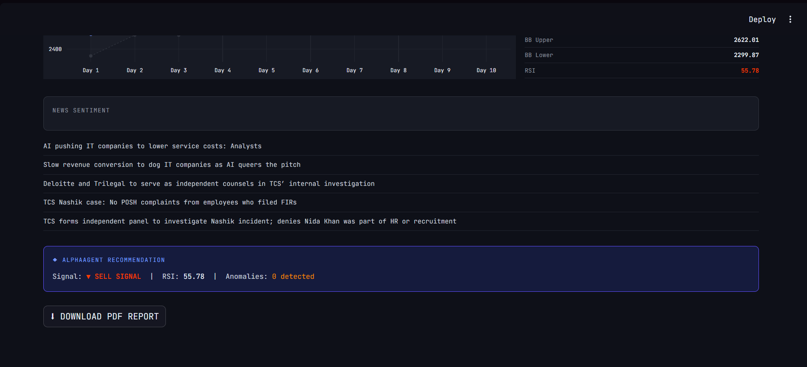

<div align="center">


<br/><br/>


### Autonomous Stock Market Intelligence Agent

*Real-time data · Technical analysis · Anomaly detection · LLM-powered insights · Professional PDF reports*

<br/>

[🚀 Live Demo](#-getting-started) · [📖 Documentation](#️-architecture) · [🎯 Features](#-features) · [📊 Screenshots](#-screenshots)

</div>

---

## 🧠 What is AlphaAgent?

**AlphaAgent** is a production-grade autonomous AI agent that thinks, reasons, and analyzes stock markets like a professional equity analyst — on demand, in seconds.

Unlike a simple dashboard that just visualizes data, AlphaAgent uses a **ReAct reasoning loop** to autonomously decide which tools to call, execute them, observe the results, and synthesize a comprehensive analysis — all without being told what to do step by step.

Ask it *"Should I be worried about TCS right now?"* and it will automatically:

1. Fetch live price and fundamental data from NSE
2. Calculate RSI, MACD, Bollinger Bands, and Moving Averages
3. Run Z-score anomaly detection on price and volume
4. Scrape and sentiment-analyze the latest financial news
5. Deliver a professional analyst-style report — in plain English

> **Built by Harsh Bhatt** — Final Year BCA, DSEU New Delhi · [LinkedIn](https://linkedin.com/in/harsh-bhatt-2275182b0) · [GitHub](https://github.com/harshbhatt1600)

---

## ✨ Features

| Feature | Description |
|---|---|
| 🤖 **Autonomous AI Agent** | ReAct loop agent — reasons, acts, observes, and iterates autonomously |
| 📈 **Live Market Data** | Real-time NSE/BSE/Global stock data via yfinance |
| 📊 **Technical Analysis** | RSI, MACD, Bollinger Bands, Moving Averages with BULLISH/BEARISH signals |
| 🔍 **Anomaly Detection** | Z-score statistical flagging of unusual price and volume activity |
| 📰 **News Sentiment** | LLM-powered analysis of latest financial headlines — not keyword matching |
| 🗄️ **PostgreSQL Caching** | 30-minute TTL cache reduces API calls by ~80% |
| 🗃️ **Audit Logging** | Every interaction permanently logged with full audit trail |
| 🌐 **Web Dashboard** | Professional Streamlit interface with Plotly interactive charts |
| 📄 **PDF Reports** | Bloomberg-style equity research reports via ReportLab |
| 💬 **Conversation Memory** | Agent remembers context across questions within a session |

---

## 🏗️ Architecture

```
┌─────────────────────────────────────────────────────────┐
│                    USER INTERFACE                        │
│         Streamlit Dashboard  ·  CLI Agent               │
└──────────────────────┬──────────────────────────────────┘
                       │
                       ▼
┌─────────────────────────────────────────────────────────┐
│                  AGENT BRAIN                            │
│           Groq LLM (Llama 4 Scout)                     │
│              ReAct Reasoning Loop                       │
│    Reason → Act → Observe → Reason → Final Answer      │
└──────┬──────────┬──────────┬──────────┬────────────────┘
       │          │          │          │
       ▼          ▼          ▼          ▼
┌──────────┐ ┌─────────┐ ┌────────┐ ┌──────────────┐
│  fetch_  │ │calculate│ │detect_ │ │  get_stock_  │
│  stock_  │ │_indic-  │ │anomal- │ │    news()    │
│  data()  │ │ators()  │ │ies()   │ │              │
│          │ │         │ │        │ │              │
│ yfinance │ │   ta    │ │Z-score │ │NewsAPI + LLM │
└────┬─────┘ └────┬────┘ └───┬────┘ └──────┬───────┘
     │             │          │              │
     └─────────────┴──────────┴──────────────┘
                             │
                             ▼
┌─────────────────────────────────────────────────────────┐
│                    DATA LAYER                           │
│   PostgreSQL — Stock Cache · Agent Audit Logs          │
└─────────────────────────────────────────────────────────┘
                             │
                             ▼
┌─────────────────────────────────────────────────────────┐
│                    OUTPUT LAYER                         │
│   Web Dashboard · CLI Response · PDF Equity Report     │
└─────────────────────────────────────────────────────────┘
```

---

## 📁 Project Structure

```
AlphaAgent/
│
├── agent/
│   ├── __init__.py
│   └── brain.py                  # ReAct agent loop, tool definitions, CLI
│
├── tools/
│   ├── __init__.py
│   ├── fetch_stock_data.py       # Live stock data via yfinance
│   ├── technical_indicators.py   # RSI, MACD, Bollinger Bands, MA
│   ├── anomaly_detection.py      # Z-score anomaly detection
│   ├── news_sentiment.py         # NewsAPI + LLM sentiment analysis
│   └── report_generator.py       # ReportLab PDF generation
│
├── utils/
│   ├── __init__.py
│   └── db.py                     # PostgreSQL caching + audit logging
│
├── data/                         # Logs and generated reports (gitignored)
├── dashboard.py                  # Streamlit web dashboard
├── main.py                       # Entry point
├── requirements.txt              # Dependencies
├── .env.example                  # Environment variable template
├── .gitignore
└── README.md
```

---

## 🛠️ Tech Stack

| Layer | Technology | Purpose |
|---|---|---|
| **AI Brain** | Groq API — Llama 4 Scout | LLM with tool use for autonomous reasoning |
| **Market Data** | yfinance | Free real-time NSE/BSE/Global stock data |
| **Technical Analysis** | ta (Technical Analysis library) | RSI, MACD, Bollinger Bands |
| **News** | NewsAPI + Groq LLM | News fetching + contextual sentiment scoring |
| **Database** | PostgreSQL + psycopg2 | Caching, audit logging, UPSERT |
| **Visualization** | Plotly | Interactive price charts with Bollinger Bands |
| **Web UI** | Streamlit | Data analytics web dashboard |
| **PDF Generation** | ReportLab Platypus | Professional equity research PDFs |
| **Language** | Python 3.11 | Core language |

---

## 🚀 Getting Started

### Prerequisites

- Python 3.11+
- PostgreSQL (installed and running)
- [Groq API Key](https://console.groq.com) — free
- [NewsAPI Key](https://newsapi.org) — free (100 requests/day)

### 1. Clone the Repository

```bash
git clone https://github.com/harshbhatt1600/AlphaAgent.git
cd AlphaAgent
```

### 2. Create Virtual Environment

```bash
python -m venv venv

# Windows
venv\Scripts\activate

# macOS/Linux
source venv/bin/activate
```

### 3. Install Dependencies

```bash
pip install -r requirements.txt
```

### 4. Configure Environment

Create a `.env` file in the root directory:

```env
# AI
GROQ_API_KEY=your_groq_api_key_here

# News
NEWS_API_KEY=your_newsapi_key_here

# PostgreSQL
DB_HOST=localhost
DB_PORT=5432
DB_NAME=alphaagent
DB_USER=postgres
DB_PASSWORD=your_postgres_password
```

### 5. Set Up PostgreSQL

Create the database and tables:

```sql
CREATE DATABASE alphaagent;

\c alphaagent

CREATE TABLE stock_cache (
    id SERIAL PRIMARY KEY,
    ticker VARCHAR(20) NOT NULL,
    period VARCHAR(10) NOT NULL,
    data JSONB NOT NULL,
    cached_at TIMESTAMP NOT NULL,
    UNIQUE(ticker, period)
);

CREATE TABLE agent_logs (
    id SERIAL PRIMARY KEY,
    ticker VARCHAR(20),
    user_query TEXT,
    agent_response TEXT,
    tools_used TEXT,
    created_at TIMESTAMP NOT NULL
);
```

### 6. Run the Application

**Web Dashboard:**
```bash
streamlit run dashboard.py
```
Open your browser at `http://localhost:8501`

**CLI Agent:**
```bash
python -m agent.brain
```

---

## 💬 Example Interactions

### CLI Agent

```
┌─────────────────────────────────────────┐
│  🤖 ALPHAAGENT                          │
│  Autonomous Stock Market Intelligence   │
│  Powered by Groq LLM + Real-time Data  │
└─────────────────────────────────────────┘

Commands: 'exit' to quit | 'clear' to reset conversation

You: How is Reliance Industries performing right now?

  🧠 Reasoning...
  ⚙ Calling tool: fetch_stock_data with {'ticker': 'RELIANCE.NS'}
  ⚙ Calling tool: calculate_indicators with {'ticker': 'RELIANCE.NS'}
  ⚙ Calling tool: get_stock_news with {'company_name': 'Reliance Industries'}

╔══════════════════════════ AlphaAgent ═══════════════════════════╗
║                                                                  ║
║  ## Reliance Industries Analysis                                 ║
║                                                                  ║
║  Current Price: ₹1,313  |  Change: -2.3% (3mo)                 ║
║                                                                  ║
║  Technical Indicators:                                           ║
║  • RSI: 39.58 — NEUTRAL (approaching oversold)                  ║
║  • MACD: BEARISH — downward momentum confirmed                  ║
║  • MA20 below MA50 — Death Cross in effect                      ║
║  • Bollinger Bands: Within normal range                         ║
║                                                                  ║
║  News Sentiment: NEUTRAL (score: 0.1)                           ║
║  5 volume anomalies detected in last 6 months                   ║
║                                                                  ║
║  Overall Signal: ▼ BEARISH — monitor for reversal signals      ║
║                                                                  ║
╚══════════════════════════════════════════════════════════════════╝

You: Why did it drop on March 27?

  🧠 Reasoning...
  ⚙ Calling tool: detect_anomalies with {'ticker': 'RELIANCE.NS'}
  ⚙ Calling tool: get_stock_news with {'company_name': 'Reliance Industries'}

╔══════════════════════════ AlphaAgent ═══════════════════════════╗
║  March 27 shows a Z-score of -2.58 — a significant downward    ║
║  anomaly. The news sentiment on that date was NEGATIVE.         ║
║  This aligns with sector-wide selling pressure in the           ║
║  energy sector and broader market correction signals.           ║
╚══════════════════════════════════════════════════════════════════╝
```

---

## 📊 Screenshots

### Web Dashboard — Analysis Tab


> Real-time stock analysis with price chart, technical indicators, and AI recommendation

### Web Dashboard — AI Agent Tab


> Conversational interface to the autonomous agent

### Web Dashboard — Audit Logs Tab

> PostgreSQL-backed interaction history

### Generated PDF Report

> Professional Bloomberg-style equity research report with live data

---

## 🔬 How It Works — The ReAct Loop

The core of AlphaAgent is the **ReAct (Reason + Act)** pattern:

```python
while iteration < MAX_ITERATIONS:
    # 1. LLM reasons about what it needs
    response = groq_client.chat.completions.create(
        model="meta-llama/llama-4-scout-17b-16e-instruct",
        messages=conversation_history,
        tools=TOOL_DEFINITIONS,
        tool_choice="auto"
    )
    
    # 2. If LLM wants to call a tool
    if response.tool_calls:
        tool_result = execute_tool(tool_name, tool_args)
        conversation_history.append(tool_result)
        # Loop again — LLM observes result and reasons next step
    
    # 3. If LLM has final answer
    else:
        return response.content  # Done
```

**What makes this different from a chatbot:**
- A chatbot answers from training data — it guesses
- AlphaAgent **fetches real data** before answering — it knows
- The LLM autonomously decides **which tools to call** based on the question
- It **iterates** — calling multiple tools in sequence to build a complete picture

---

## 📈 Technical Indicators — Quick Reference

| Indicator | What it measures | Signal |
|---|---|---|
| **RSI** | Momentum — how fast price is moving | >70 Overbought · <30 Oversold |
| **MACD** | Trend strength and direction | MACD > Signal = Bullish |
| **Bollinger Bands** | Volatility — price range | Outside bands = extreme move |
| **MA 20 vs MA 50** | Short vs long term trend | MA20 > MA50 = Golden Cross (Bullish) |

---

## 🗄️ Database Schema

```sql
-- Stock data cache (30-minute TTL)
CREATE TABLE stock_cache (
    id          SERIAL PRIMARY KEY,
    ticker      VARCHAR(20) NOT NULL,
    period      VARCHAR(10) NOT NULL,
    data        JSONB NOT NULL,           -- Full stock dict stored as binary JSON
    cached_at   TIMESTAMP NOT NULL,
    UNIQUE(ticker, period)                -- One cache entry per ticker+period
);

-- Agent interaction audit log
CREATE TABLE agent_logs (
    id              SERIAL PRIMARY KEY,
    ticker          VARCHAR(20),
    user_query      TEXT,
    agent_response  TEXT,
    tools_used      TEXT,
    created_at      TIMESTAMP NOT NULL
);
```

**Caching Strategy:**
- Before hitting yfinance → check if cache exists and is < 30 minutes old
- Cache HIT → return instantly (no API call)
- Cache MISS/STALE → fetch fresh, write to cache via UPSERT
- Reduces API calls by ~80% in a typical session

---

## 🔮 Roadmap

- [ ] **Backtesting Module** — test trading strategies on historical data with Sharpe ratio and max drawdown metrics
- [ ] **Portfolio Tracker** — monitor multiple stocks simultaneously with real-time alerts
- [ ] **LSTM Price Prediction** — add machine learning layer for price forecasting
- [ ] **WebSocket Streaming** — real-time price updates using Alpaca/Polygon.io
- [ ] **Docker Deployment** — containerize for one-command cloud deployment
- [ ] **Multi-user Support** — authentication and per-user portfolios

---

## 🧩 Key Engineering Decisions

**Why Groq instead of OpenAI?**
Groq provides completely free API access with production-grade speed. The Llama 4 Scout model has excellent tool-use capabilities. $0 cost makes it sustainable for a portfolio project with frequent testing.

**Why PostgreSQL instead of SQLite?**
PostgreSQL is what EY, Deloitte, and major financial institutions actually use. It supports JSONB (queryable binary JSON), array types, and enterprise-grade concurrency. Using it demonstrates production-grade database choices.

**Why Z-score for anomaly detection instead of fixed thresholds?**
A fixed threshold like "flag any 50% volume spike" doesn't account for each stock's natural volatility. Z-score is self-normalizing — it adapts to each stock's own historical behavior. A volatile stock and a stable blue-chip get appropriately different baselines.

**Why LLM sentiment instead of VADER/TextBlob?**
Traditional sentiment libraries use word lists and rules. They'd classify "TCS avoids losses despite headwinds" as negative (sees "losses"). The LLM understands that avoiding losses is positive — financial context matters.

**Why `parallel_tool_calls=False`?**
Forcing sequential tool calls gives the LLM time to observe each result before deciding the next action. Parallel calls can confuse the reasoning chain and produce lower quality final answers.

---

## 👨‍💻 Author

**Harsh Bhatt**

Final Year BCA Student · Delhi Skill and Entrepreneurship University · CGPA 9.2/10

Data Analytics enthusiast building production-grade AI systems. Actively seeking Data Analyst roles in Delhi/Gurgaon.

[](https://linkedin.com/in/harsh-bhatt-2275182b0)
[](https://github.com/harshbhatt1600)
[](mailto:harshbhatt296@gmail.com)

---

## 📄 License

This project is licensed under the MIT License — see the [LICENSE](LICENSE) file for details.

---

## ⚠️ Disclaimer

AlphaAgent is built for educational and portfolio demonstration purposes. It does not constitute financial advice. Always consult a qualified financial advisor before making investment decisions. Past performance of any stock is not indicative of future results.

---

<div align="center">

**Built with 🔥 by Harsh Bhatt**

*If this project helped you, please consider giving it a ⭐*

</div>